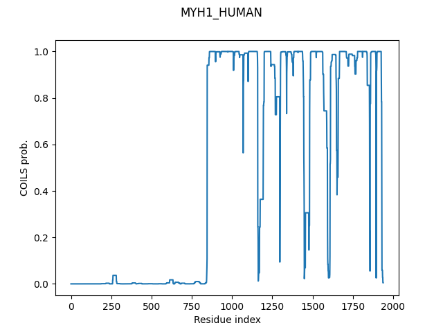
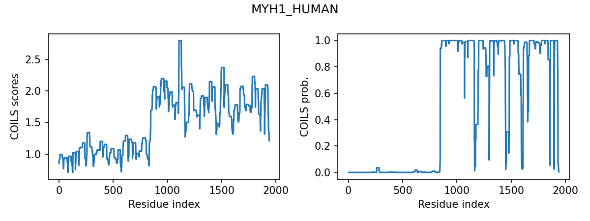
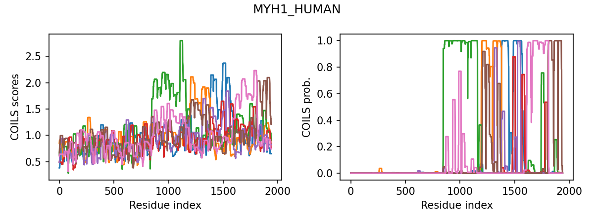

# PyCOILS
A Python implementation of the classic COILS program


## Motivation

Coiled coils are common structural motifs found in proteins, the fundamental catalysts of life. COILS was the first computer program capable of predicting the presence of coiled coils from protein sequence. During my PhD, I reimplemented the original COILS C++ code into a Python script. Although the research line that I was following back then proved unproductive, I regard that script as the first "serious" program that I wrote (which speaks of my standards at the time). I learned a lot while developing it, and it helped me immensely to understand how COILS actually works. I named the program I had developed PyCOILS (very creative, I know; also, do not mix this with the profile-based PCOILS!)

Why have I created this repository? Mainly for myself, to be honest. Making the code publicly available was the motivation I required to clean up the code and refactor it into a more presentable format. But, incidentally, I think it serves as a nice 'Exhibit A' of early bioinformatics algorithms. In this re-implementation, I have prioritized legibility and simplicity over efficiency. This is to say, the original code may have run faster. That being said, the program presents a couple of additions over the original COILS, which I think may motivate some users to utilize my version. If you do so, please cite the original COILS research article, which can be found in the **References** section.


## Installation

PyCOILS can be downloaded, packaged and installed via pip like this:

```bash
# to install the latest PyCOILS version
pip install git+https://github.com/Mikel-MG/PyCOILS.git

# to run the test checks (optional but recommended) 
python -m pycoils.testing
```


## Usage

There is an [example notebook](./examples/examples.ipynb) that illustrates how to use the program and its features.


## Features

* PyCOILS reproduces the behaviour and results of the original COILS, but can be easily integrated into Python scripts, for analysis and visualization.




* In addition to coiled-coil probabilities, PyCOILS implements the option of providing the raw scores. This can be useful when analyzing protein sequences that show very low or noisy coiled-coil prediction.  




* The classic COILS program computes, for each residue, the highest score among different possible registers and windows. PyCOILS' *allframe* mode provides not only the *best* score, but the best score for every frame separately. This is useful to a) automatically detect discontinuities in the heptad register, and b) detect coiled-coil sequences with multiple potential registers.  




## Future work

The program is functional and effectively finished. At some point, I would like to return to it an add a couple of features, as indicated below. If you use the program and find some issues, bugs, or suggestions, I would really appreciate if you get in touch.


### ToDo

* [ ] Simple profiling
* [ ] Potential optimization
  + [ ] Flatten dictionary
  + [ ] Avoid creating an empty array for window_scores every window


### What I will not Do:

* Exporting results, such as to .csv, .pkl, or .png -> If you are running this program you know how do this yourself. It would be trivial to add code to do this, but also, it would add unnecessary complexity to the PyCOILS code, which is meant just to be an implementation of the COILS algorithm.

* Command-Line Interface (CLI) -> If you are running COILS predictions several times a day, and want a convenient way of accessing this functionality, see the point above.


## References

```
Lupas, Andrei, Marc Van Dyke, and Jeff Stock. “Predicting Coiled Coils from Protein Sequences.” Science 252, no. 5009 (May 24, 1991): 1162–64. https://doi.org/10.1126/science.252.5009.1162.
```
